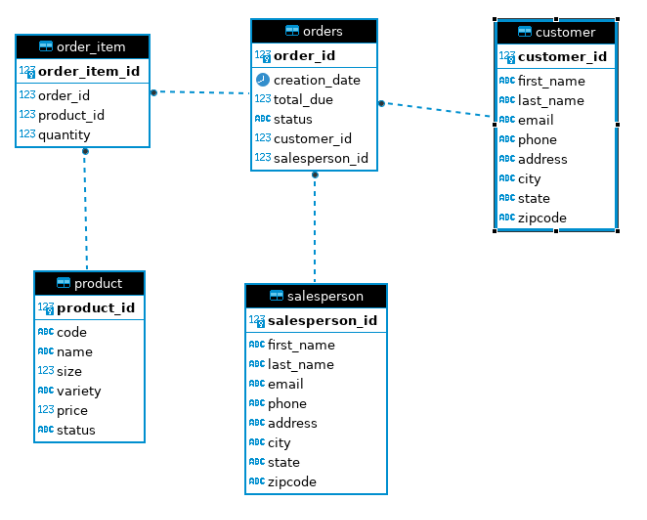

# Introduction
The app establishes an abstraction of a database containing tables
that consist of customers and their orders represented into Java
as their own objects. JDBC libraries were used to create a 
connection between a PSQL Database and Java. Maven was used for
project management. Docker was used for setup for the containerized
PSQL databases.

# Implementation
## ER Diagram

## Design Patterns
The DAO design pattern (Data Access Object) is a way that allows
one to perform CRUD operations, create, read, update, and delete,
on an object such as a row with its table in a database. This is done to separate the actions
away from the actual object aka. the DTO (Data Transfer Object).
For example, we can create a new customer, a DTO, and store it
into our table using our create method of our CustomerDAO. 
We can now read, update, or delete it from the database using
our DAO.

The Repository design pattern implements an object that can manage
and perform actions on different DAOs. If each DAO is used to 
manage a different table in our database, like a CustomerDAO and
an orderDAO, then a repository design pattern object can
find a customer using the CustomerDAO object and apply it to the orderDAO
in one call. This allows a user to perform an action without calling
all the necessary queries.

# Test
Initially, the data was created using Data definition language (DDL)
queries. Tables of sample data was stored in the PSQL database as
noted in the ER Diagram. The app was tested by observing the data
within the database by testing the 4 CRUD operations: Create, Read,
Update, and Delete. By running the app, I was able to create a new customer
object, store their information into a table, read their information and a
different customer's information, update one of the customers email,
and delete that customer from the database.