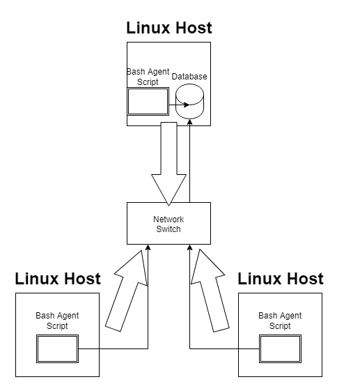

# Linux Cluster Monitoring Agent
# Introduction
In real-time, the Linux Cluster Administration (LCA) team wants to track information stored from each node of a Linux cluster.
Each node contains information about its hardware like the CPU model, CPU architecture, total memory, etc.
It also contains data about its resource usage such as disk space available, free memory, etc.
The goal of the cluster monitoring agent is to collect this data from multiple nodes and store it into tables located in a database.
The LCA team can use this information to control and plan what is needed to use its resources better and more efficiently.
For example, if node one uses more memory than node two, the LCA team can allocate more memory towards node one if they share the same CPU number.

The technologies used in this project are the following:
- Bash for scripting
- Docker for creation of containers and instances
- Git for repository version control and distribution
- PSQL for database creation and management
- Cron for real-time data collection
# Quick Start
1. Start off by downloading/cloning the repository into your local repository/directory and direct yourself to the linux_sql directory in your console/terminal
2. Start a psql instance using psql_docker.sh
    - Create the psql docker container
    - Start the instance
```
./scripts/psql_docker.sh create PSQL_USERNAME PSQL_PASSWORD
```
```
./scripts/psql_docker.sh start
```
- Create tables using ddl.sql
```
psql -h localhost -U PSQL_USERNAME -d host_agent -f sql/ddl.sql
```
- Insert hardware specs data into the DB using host_info.sh
```
./scripts/host_info.sh localhost 5432 host_agent PSQL_USERNAME PSQL_PASSWORD
```
- Insert hardware usage data into the DB using host_usage.sh
```
./scripts/host_usage.sh localhost 5432 host_agent PSQL_USERNAME PSQL_PASSWORD
```
- Crontab setup
```
crontab -e
* * * * * ABSOLUTE_PATH_TO_DIRECTORY/linux_sql/scripts/host_usage.sh
localhost 5432 host_agent PSQL_USERNAME PSQL_PASSWORD > /tmp/host_usage.log
```
# Implementation
## Architecture

## Scripts

<details><summary>psql_docker.sh</summary>
<p>

Create a docker container with a username and password.
```
./scripts/psql_docker.sh create PSQL_USERNAME PSQL_PASSWORD
```
Start the docker container with no other arguments
other than start.
```
./scripts/psql_docker.sh start
```
Stop the docker container with no other arguments
other than stop.
```
./scripts/psql_docker.sh stop
```
The script can create a new docker container and creates
a PostgresSQL image. It can be used to start up the container
or stop the container as if turning off and on.
</p>
</details>
<details><summary>host_info.sh</summary>
<p>

Insert host's information given the host address, the port,
the database name, the username, and password as arguments.
```
./scripts/host_info.sh psql_host psql_port db_name PSQL_USERNAME PSQL_PASSWORD
```
</p>
</details>
<details><summary>host_usage.sh</summary>
<p>

Insert host's usage given the host address, the port,
the database name, the username, and password as arguments.
```
./scripts/host_usage.sh psql_host psql_port db_name PSQL_USERNAME PSQL_PASSWORD
```
</p>
</details>
<details><summary>crontab</summary>
<p>

Edit the crontab job
```
crontab -e

* * * * * bash ABSOLUTE_PATH_TO_DIRECTORY/linux_sql/scripts/host_usage.sh
psql_host psql_port db_name PSQL_USERNAME PSQL_PASSWORD > /tmp/host_usage.log
```
The crontab job will schedule the bash script to be run every
minute as the node is on. This will be used to continuously
store the host usage within the database.
</p>
</details>
<details><summary>queries.sql</summary>
<p>
queries.sql contains three different queries that can be used to retrieve specific data from the database.

The first query sorts the data by cpu_number and displays 
each host_id with their total memory. This is used to check
which host on each cpu uses the most memory.

The second query gathers the average used memory percentage
of each host within a 5-min period.

The third query finds which host has less than 3 data-points
within a 5-minute period. This is used to check if the server
is still running properly as each 5-minute interval should have
at least 3 data-points.
</p>
</details>

## Database Modeling
- `host_info`

| id                                 | hostname | cpu_number | cpu_architecture | cpu_model | cpu_mhz | L2_cache | total_mem | timestamp |
|------------------------------------| --- | --- | --- | --- | --- | --- | --- | --- |
| Database Auto-incrementing Host ID | Fully Qualified Hostname | Number of CPU Cores | Architecture of the CPU | Model of the CPU | Frequency of the CPU | Level 2 Cache (in kB) | Total Memory | Current Time (UTC time zone) |
- `host_usage`

| timestamp                         | host_id                  | memory_free         | cpu_idle | cpu_kernel | disk_io            | disk_available                                     | 
|-----------------------------------|--------------------------|---------------------| --- | --- |--------------------|----------------------------------------------------|
| Current Time (UTC time zone) | Host ID from the `hosts_info` table | Number of CPU Cores | CPU Time Not Being Used (idle time as a percentage) | CPU Time spent Running the Kernel (as a percentage) | Number of Disk I/O | Available Disk Space in the Root Directory (in MB) | 

# Test
<details><summary>Testing psql_docker.sh</summary>
<p>

Stop any running docker containers
```
./scripts/psql_docker.sh stop
```
Remove any previous docker containers
```
docker container rm jrvs-psql
```
Create the docker container
```
./scripts/psql_docker.sh create dvdhyh22 password
```
Check the docker container jrvs-psql has been created
```
docker container ls -a
```
Start the docker container
```
./scripts/psql_docker.sh start
```
Check the docker container jrvs-psql is running
```
docker ps -f name=jrvs-psql
```
If the container is listed, then the script worked.
</p>
</details>

<details><summary>Testing ddl.sql</summary>
<p>

Create the tables and entering my password "password"
```
psql -h localhost -U dvdhyh22 -d host_agent -f sql/ddl.sql
```
Tables are successfully created after being connected to the
host_agent database and having an output of two CREATE TABLE lines.

</p>
</details>

<details><summary>Testing host_info.sh and host_usage.sh</summary>
<p>

Store current hosts info and usage with the following lines
```
./scripts/host_info.sh localhost 5432 host_agent dvdhyh22 password
./scripts/host_usage.sh localhost 5432 host_agent dvdhyh22 password
```
Check if the data has been stored into the database
```
psql -h localhost -U dvdhyh22 -d host_agent
host_agent=# SELECT * FROM host_info;
host_agent=# SELECT * FROM host_usage;
```
The scripts work if the two tables displayed has the correct data.
</p>
</details>

<details><summary>Testing Crontab</summary>
<p>

Edit the crontab job
```
crontab -e

* * * * * bash ABSOLUTE_PATH_TO_DIRECTORY/linux_sql/scripts/host_usage.sh
localhost 5432 host_agent dvdhyh22 password > /tmp/host_usage.log
```
Check if the data has been stored into the database after 1 minute intervals
```
psql -h localhost -U dvdhyh22 -d host_agent
host_agent=# SELECT * FROM host_usage;
```
The scripts work if the table displays multiple lines of data
from the same host_id but different timestamps.
</p>
</details>

<details><summary>Testing queries.sql</summary>
<p>

To test queries.sql, I entered the database and inserted
a few data-points to test.
```
psql -h localhost -U dvdhyh22 -d host_agent
INSERT INTO host_info(...) VALUES(...);
INSERT INTO host_usage(...) VALUES(...);
```
For the first query, I inserted a few data-points with
the same cpu_number, different host_id's, and ranging total_mem
to check if they are sorted by total_mem correctly.
I also added a few with different cpu_numbers to see if
the cpu_numbers are grouped together when listed.

For the second query, I inserted a few data-points with different
total_mem and memory_free. I also let crontab insert data-points
in one minute intervals to get extra data-points.

Lastly for the third query, I didn't need to add any extra
since the crontab job inserted more than 3 within a 5-minute interval
and the extra ones I added had only one data-point which will be
displayed.

Run the queries
```
psql -h localhost -U dvdhyh22 -d host_agent -f sql/queries.sql
```
</p>
</details>

# Deployment

The minimum viable product is deployed through GitHub, Docker, and crontab.
All scripts and files are hosted by GitHub and is cloned by the user
for usage. The database is hosted by Docker where only one user or host (LCA team)
needs to setup. Crontab is used to consistently run the host_usage.sh
so that it can automatically collect data in intervals that is set up
by the user.
# Improvements

- Collect data about files such as oldest file
accessed or largest size file
- Create more sample queries for database hosts to collect
more different types of information
- Collect data about processes and which ones use the most
memory

